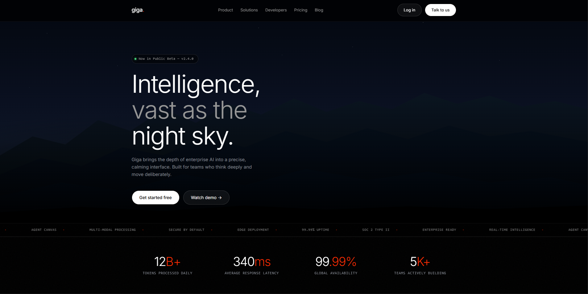

# Giga 🌌

> **AI Enterprise Platform** — Intelligence, vast as the night sky.



---

## 🏷️ Tags

`AI / Enterprise SaaS` &nbsp; `Industri: Developer Tools` &nbsp; `Target: Engineering Teams & Tech Startups`

---

## 📌 Tentang Project

**Giga** adalah landing page untuk platform AI enterprise yang dirancang dengan estetika **"deep night, mountain vista"** — memadukan ketenangan visual kosmik dengan ketegasan informasi teknis.

Platform ini ditujukan untuk **tim engineering, tech lead, dan decision maker** di perusahaan yang membutuhkan solusi AI yang serius: mulai dari agent builder, model gateway, observability dashboard, hingga zero-trust security. Semua dalam satu platform yang terasa calming, precise, dan enterprise-ready.

Project ini dibangun murni menggunakan **HTML, CSS, dan Vanilla JavaScript** — tanpa framework, tanpa library UI — dengan design system yang konsisten berbasis CSS custom properties dari file `variables.css` dan `DESIGN.md`.

---

## ❗ Masalah yang Diselesaikan

### 1. Kepercayaan yang Sulit Dibangun di Kategori AI Enterprise

Platform AI enterprise sering tampil terlalu teknis atau terlalu generik. Decision maker — terutama CTO dan Staff Engineer — sulit merasakan "trust" hanya dari tampilan antarmuka biasa. Mereka butuh kesan bahwa produk ini **matang, stabil, dan bisa diandalkan di skala besar**.

### 2. Informasi Terlalu Padat Tanpa Hierarki yang Jelas

Produk dengan banyak fitur teknis (model routing, agent builder, observability, security compliance, dsb.) sering menyajikan semua informasi sekaligus. Pengunjung kebingungan: _"Ini sebenarnya untuk siapa, dan apa yang harus saya lakukan pertama?"_

### 3. Tidak Ada Identitas Visual yang Membedakan

Mayoritas platform AI terlihat serupa — putih bersih atau ungu gelap dengan gradien generik. Tidak ada karakter visual yang membuat produk mudah diingat setelah tab ditutup.

### 4. Konversi yang Lemah di Halaman Pertama

Banyak landing page AI gagal mengubah kunjungan pertama menjadi tindakan nyata (sign up, book demo, dsb.) karena pesan utamanya tidak tajam dan CTA-nya tidak menonjol secara visual maupun posisi.

### 5. Hero Section yang Bergantung pada Aset Berat

Kebanyakan landing page premium mengandalkan foto, video background, atau ilustrasi berat untuk menciptakan kesan visual yang kuat. Ini memperlambat loading dan menambah ketergantungan pada aset eksternal.

---

## ✅ Solusi yang Diberikan

### Dark Premium Design System yang Konsisten

Seluruh halaman menggunakan **design token** dari `variables.css` — warna, tipografi, spacing, border radius, dan shadow semuanya terdefinisi sebagai CSS custom property. Hasilnya: tampilan yang kohesif dari header hingga footer, terasa seperti produk yang well-engineered.

Token utama yang digunakan:

| Token                      | Value                  | Fungsi                                   |
| -------------------------- | ---------------------- | ---------------------------------------- |
| `--color-obsidian`         | `#000000`              | Background utama                         |
| `--color-ghost`            | `#ffffff`              | Teks utama                               |
| `--color-ember-glow`       | `#fe2c02`              | Aksen merah — CTA, label, ticker dot     |
| `--color-growth-green`     | `#49de80`              | Indikator positif — badge, check, metric |
| `--color-night-sky`        | `#161717`              | Surface sekunder — card, CTA section     |
| `--color-cosmic-dust`      | `#8a8f98`              | Teks deskripsi / caption                 |
| `--gradient-subtle-violet` | `linear-gradient(...)` | Product card — Agent Studio              |
| `--gradient-soft-mint`     | `linear-gradient(...)` | Product card — Analytics Hub             |
| `--gradient-sky-blue`      | `linear-gradient(...)` | Product card — Model Gateway             |

### Hero Section Immersive — Pure CSS, Zero Image Asset

Alih-alih foto atau video background, hero section dibangun **sepenuhnya dengan CSS dan SVG inline**:

- **Silhouette gunung berlapis** — 3 layer SVG path dengan gradien berbeda menciptakan kedalaman
- **Langit berbintang** — 17 titik bintang menggunakan `radial-gradient` yang diposisikan manual
- **Efek aurora** — `radial-gradient` ellipse di bagian atas langit
- **Noise texture overlay** — SVG `feTurbulence` filter untuk tekstur subtle

Hasilnya: visual yang immersive dan on-brand, **tanpa satu pun file gambar yang perlu di-load**.

### Hierarki Informasi Strategis

Struktur halaman dirancang mengikuti alur logis pengambilan keputusan pengguna B2B:

```
Navbar sticky (navigasi + CTA selalu tersedia)
  ↓
Hero (kesan pertama — positioning + CTA utama)
  ↓
Ticker Marquee (sinyal kepercayaan pasif — fitur & sertifikasi)
  ↓
Metrics Bar (bukti angka — 12B+ tokens, 340ms, 99.99% uptime)
  ↓
Features Grid (detail 6 kemampuan utama)
  ↓
Product Showcase (visual antarmuka + benefit list)
  ↓
Product Cards (3 solusi per kategori dengan gradient branding)
  ↓
Testimonials (social proof dari engineering & CTO persona)
  ↓
CTA Banner (dorongan akhir untuk kontak sales)
  ↓
Footer (navigasi lengkap + branding)
```

Setiap section memiliki satu tujuan komunikasi, tidak lebih.

### Tipografi Ekspresif — Font Light dengan Negative Tracking

Menggunakan **Inter weight 300** dengan `letter-spacing: -0.03em` untuk heading besar. Hasilnya: kesan sofistikasi dan ketenangan — bukan berteriak, tapi berbicara dengan otoritas. Ciri khas desain premium seperti Linear, Vercel, dan Anthropic.

### Sistem Button Tiga Varian

Sesuai design spec dengan `border-radius: 1000px` sebagai signature visual:

| Varian             | Background          | Penggunaan              |
| ------------------ | ------------------- | ----------------------- |
| **Ghost Pill**     | Transparan + border | Aksi sekunder (Log in)  |
| **Primary Filled** | Putih di atas gelap | CTA utama (Get started) |
| **Dark Filled**    | Night sky `#161717` | CTA di section terang   |

### Ticker Marquee — Social Proof Pasif

Baris teks berjalan otomatis menampilkan fitur dan sertifikasi (SOC 2 Type II, 99.99% Uptime, Edge Deployment, dsb.). Pengunjung menyerap informasi ini secara tidak sadar — membangun kepercayaan tanpa mengganggu alur baca utama.

### Scroll Animation dengan Intersection Observer

Semua kartu menggunakan kelas `.fade-up` yang diaktifkan oleh **Intersection Observer API** — tanpa library JavaScript eksternal. Animasi masuk halus saat elemen memasuki viewport, dengan `transition-delay` bertahap antar card dalam satu grid.

---

## 🎨 Design Decisions

| Aspek                | Keputusan                         | Alasan                                   |
| -------------------- | --------------------------------- | ---------------------------------------- |
| **Style**            | Deep black + aksen merah/hijau    | Premium, tegas, berbeda dari kompetitor  |
| **Font utama**       | Inter 300 (light)                 | Sofistikasi tanpa kehilangan keterbacaan |
| **Heading tracking** | `-0.03em`                         | Signature visual brand premium           |
| **Button shape**     | Pill `border-radius: 1000px`      | Identitas visual yang konsisten          |
| **Hero background**  | Pure CSS + SVG                    | Zero image dependency, fast load         |
| **Product cards**    | Gradient terang di atas dark page | Kontras kuat, mudah dibedakan            |
| **Aksen utama**      | Ember glow `#fe2c02`              | Energik, memorable, tidak pasaran        |

**Color Palette:**

| Nama         | Hex       | Fungsi                      |
| ------------ | --------- | --------------------------- |
| Obsidian     | `#000000` | Background utama            |
| Ghost        | `#ffffff` | Teks & button primary       |
| Ember Glow   | `#fe2c02` | Aksen utama & CTA           |
| Growth Green | `#49de80` | Indikator positif           |
| Night Sky    | `#161717` | Surface kartu & CTA section |
| Cosmic Dust  | `#8a8f98` | Teks sekunder / deskripsi   |
| Pebble Gray  | `#969696` | Teks tertier / nav links    |

---

## 🛠️ Tech Stack

| Teknologi                     | Penggunaan                                                |
| ----------------------------- | --------------------------------------------------------- |
| **HTML5 Semantik**            | `nav`, `section`, `footer` untuk aksesibilitas & SEO      |
| **CSS Custom Properties**     | Design token system — semua nilai visual terdefinisi      |
| **CSS Grid**                  | Layout features (3 col), products (3 col), footer (4 col) |
| **CSS Flexbox**               | Navbar, hero actions, metric items, testimonial author    |
| **SVG Inline**                | Ilustrasi mountain landscape berlapis, ikon fitur         |
| **CSS Gradients**             | Hero sky, product cards, aurora, bintang, divider         |
| **CSS Keyframes**             | Ticker marquee scroll, hero badge pulse                   |
| **Intersection Observer API** | Scroll-triggered fade-up animation                        |
| **Google Fonts**              | Inter + Inter Display                                     |

> **Zero framework. Zero library UI. Zero build process.** Buka `index.html` langsung di browser.

---

## ✨ Fitur Utama Landing Page

- 🌄 **CSS-only mountain hero** — landscape malam berlapis tanpa satu pun file gambar
- ⭐ **Starfield background** — bintang manual dengan `radial-gradient`
- 📡 **Live badge** dengan animasi pulse hijau di hero
- 📰 **Ticker marquee** fitur & sertifikasi berjalan otomatis
- 📊 **Metrics bar** — 4 angka kunci dengan aksen ember glow
- 🃏 **6 feature cards** dengan hover state dan top-line gradient
- 🖥️ **Product showcase** — mock screen UI dengan floating badge stats
- 🎨 **3 gradient product cards** — violet / mint / sky blue sesuai design token
- 💬 **3 testimonial cards** — persona engineering, AI lead, dan CTO
- 💡 **Sticky navbar** dengan glassmorphism backdrop blur
- 📱 **Fully responsive** — 3 col → 2 col → 1 col breakpoint

---

## 🚀 Cara Menjalankan

```bash
# Clone repository
git clone https://github.com/PutuDio/GIGA.git

# Masuk ke direktori
cd GIGA

# Buka langsung di browser
open index.html

# Atau gunakan Live Server di VS Code
# Klik kanan index.html → "Open with Live Server"
```

Tidak ada `npm install`. Tidak ada build process. Langsung jalan.

---

## 📁 Struktur File

```
giga-landing/
├── index.html          # Seluruh halaman (HTML + CSS inline + JS)
├── css                 # Design token — warna, tipografi, spacing, radius
│    └── login.css
│    └── page.css
│    └── style.css
├── page                 # Fokus halaman (login, register, blog, pricing, contact)
│    └── login.html
│    └── register.html
│    └── blog.html
│    └── pricing.html
│    └── contact.html
├── preview.png         # Screenshot untuk README ini
└── README.md           # Dokumentasi ini
```

---

## 🌐 Live Demo

[🔗 [Lihat Live Demo](https://giga-azure.vercel.app/)](#) 

---

## 💡 Pelajaran dari Project Ini

1. **Design token adalah fondasi** — dengan CSS custom property yang terorganisir, perubahan warna atau spacing bisa dilakukan di satu tempat dan langsung berdampak ke seluruh halaman.
2. **CSS modern sangat powerful** — pemandangan gunung berlapis yang immersive bisa diciptakan tanpa satu pun file gambar.
3. **Hierarki visual = hierarki bisnis** — urutan section bukan keputusan estetika, tapi keputusan strategis tentang bagaimana pengguna membuat keputusan pembelian.
4. **Restraint menghasilkan premium** — menahan diri dalam penggunaan warna dan animasi justru menghasilkan tampilan yang lebih sophisticated.
5. **Zero dependency = full control** — tanpa framework, tidak ada "magic" yang tidak dipahami. Setiap baris CSS punya tujuan yang jelas.

---

## 📚 Inspirasi & Referensi

| Brand         | Yang Diambil                        |
| ------------- | ----------------------------------- |
| **Linear**    | Dark mode minimal, aksen fungsional |
| **Vercel**    | Tipografi halus, layout bersih      |
| **Anthropic** | Ketenangan visual untuk produk AI   |
| **Framer**    | Product showcase yang profesional   |

---

## 👤 Developer

**Putu Dio** — Frontend Developer

- 🌐 Portfolio: [Coming Soon](#)
- 💼 LinkedIn: [[linkedin.com/in/putudiokenneta](https://www.linkedin.com/in/putu-dio-kenneta-09818440b/)](#)
- 🐙 GitHub: [[github.com/PutuDio](https://github.com/PutuDio)](#)

---

## 📄 Lisensi

Project ini dibuat bebas digunakan sebagai referensi pembelajaran.

---

<p align="center">
  <em>"Intelligence, vast as the night sky."</em><br/>
  Dibuat dengan ☕, banyak iterasi, dan satu design system yang konsisten.
</p>
